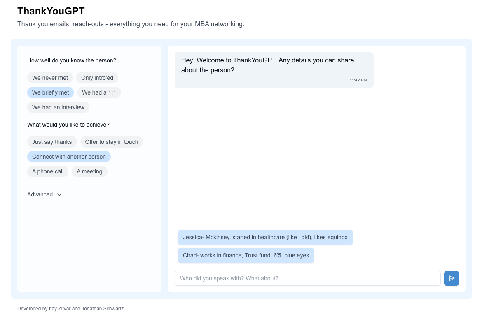

# ThankYouGPT

A tool for writing thank you emails for MBA networking, coffee chats, and professional outreach. Used by consultants and bankers at Wharton and Booth.

**Live:** [https://www.thank-you-gpt.com/](https://www.thank-you-gpt.com/)

## What it does

ThankYouGPT helps you craft personalized thank you emails and networking messages. Select your relationship level (e.g., "We briefly met", "We had a 1:1"), choose your goal (e.g., "Just say thanks", "Offer to stay in touch"), and provide details about the person. The AI generates a tailored message.

## How it looks



- **Left sidebar:** Select relationship level and communication goal
- **Right panel:** Chat interface where you share details about the person

## Run locally

1. Clone the repository and install dependencies:

```bash
git clone https://github.com/itayzit/thankyougpt.git
npm install
```

2. Create a `.env.local` file in the project root and add your API keys:

```
OPENAI_API_KEY=your_openai_api_key_here
DATABASE_URL=your_database_url_here
```

3. Start the development server:

```bash
npm run dev
```

Open [http://localhost:3000](http://localhost:3000) in your browser.

## Developed by

[Itay Zitvar](https://www.linkedin.com/in/itayzitvar/) and [Jonathan Schwartz](https://www.linkedin.com/in/jonathan-schwartz8/)
